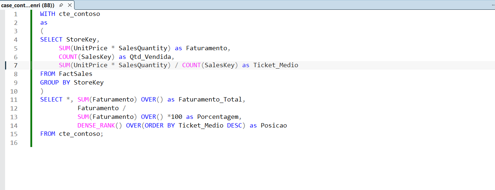
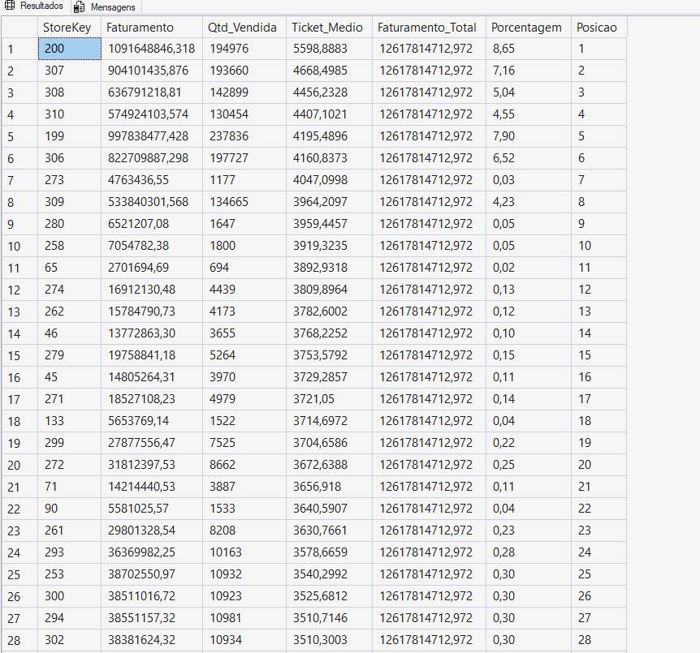
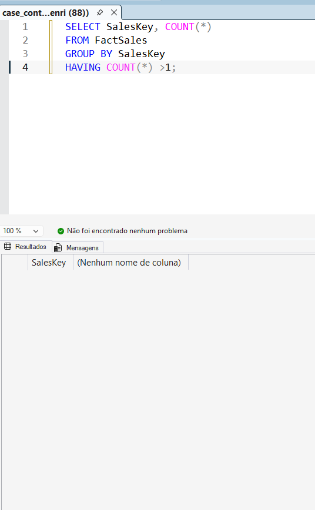

# contoso-sales-analysis-sql
SQL project analyzing store performance using the Contoso dataset with business metrics, ranking and window functions.

📊 CASE: EMPRESA CONTOSO
Análise de Performance de Lojas — SQL (Contoso Dataset)

# 🎯 Objetivo

Este projeto tem como objetivo analisar a performance das lojas a partir de dados de vendas, calculando métricas fundamentais de negócio e criando um ranking baseado no ticket médio.

O case simula um cenário comum em empresas de varejo, onde é necessário entender:

1.Quais lojas faturam mais

2.Qual o comportamento médio de compra

3.Participação percentual de cada loja no faturamento total

4.Ranking de desempenho entre lojas

## 📂 Dataset

Base utilizada: Microsoft Contoso BI Demo Dataset for Retail Industry

Tabela principal: FactSales

##🔍 Validação da Granularidade dos Dados

Antes do cálculo das métricas, foi realizada uma verificação para entender a granularidade da tabela FactSales, especificamente se o identificador SalesKey representava uma venda única ou se poderia existir mais de uma linha por pedido.

Esse tipo de validação é importante, pois garante que métricas como Ticket Médio não sejam distorcidas.

Query utilizada
SELECT 
    SalesKey,
    COUNT(*) AS Contagem
FROM FactSales
GROUP BY SalesKey
HAVING COUNT(*) > 1;

Resultado:

Nenhum registro retornado.

Conclusão

- Cada SalesKey aparece apenas uma vez na tabela

- A granularidade da base é 1 linha = 1 venda

- O cálculo do Ticket Médio utilizando COUNT(SalesKey) é adequado

- Não foi necessário utilizar COUNT(DISTINCT)

## 📊 Métricas Calculadas

- Faturamento Total

- Quantidade de Vendas

- Ticket Médio

- Participação (%) no Faturamento Total

- Ranking por Ticket Médio

## 🧠 Lógica de Desenvolvimento

- A construção da solução foi feita em etapas:

- Agregação inicial por StoreKey

- Criação das métricas principais: Faturamento, Quantidade e Ticket Médio

- Uso de Window Function para cálculo do faturamento total

- Cálculo da participação percentual

- Aplicação de ranking utilizando DENSE_RANK()

## 🛠️ Tecnologias Utilizadas

- SQL Server (Banco de Dados)

- SQL Server Management Studio — SSMS (Ambiente de Desenvolvimento)

- T-SQL

- CTE (Common Table Expressions)

- Window Functions

- Funções de Agregação

- Funções Analíticas (Ranking)

## 📈 Principais Aprendizados

Durante o desenvolvimento deste case foram praticados conceitos importantes, como:

- Validação de granularidade de tabela fato

- Construção de métricas de negócio

- Uso de Window Functions para evitar subqueries complexas

- Aplicação de ranking analítico

- Organização de consultas SQL em etapas lógicas

## 🚀 Melhorias Futuras

- Algumas evoluções que podem ser implementadas:

- Análise temporal por mês

- Ranking por faturamento

- Dashboard em Power BI

- Análise por categoria de produto

## 📸 Query Utilizada

## 📊 Resultado

##  ✅  Validação de Granulidade

👤 Autor

José Henrique

Projeto desenvolvido para fins de estudo e aprimoramento profissional na área de Análise de Dados.
